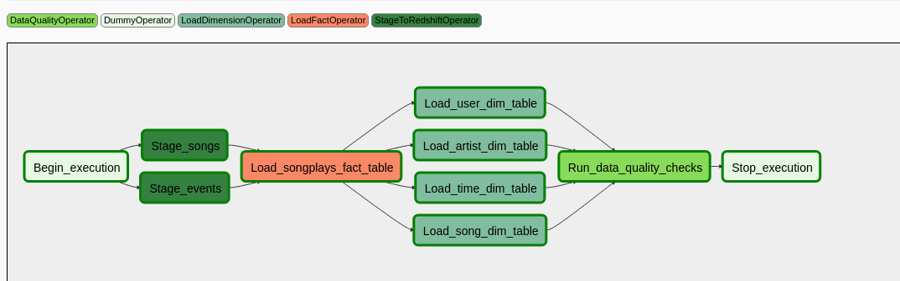
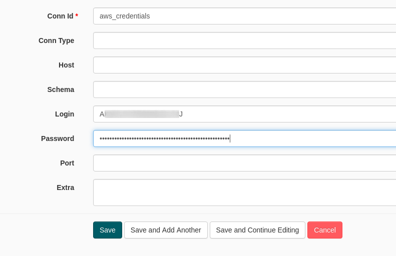
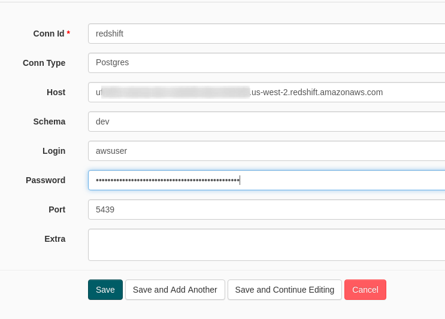

# Udacity Data Engineer Nanodegree - Project 5: Data Pipelines

In this project Airflow is used to coordinate tasks that process large
amounts of data for a fictional music streaming service, which is called
Sparkify.

## Problem

The scenario that should be solved in this project is: 
Sparkify has gained a lot new users and the song database as well as the
recorded song plays have increased over time.

Sparkify has created a dump of the data in Amazon S3 storage.
This dump currently consists of JSON logs of the user activity and metadata
on the songs.

To improve analysis of the data, the data should be transformed into a star
schema.
The stored data should then be stored in a AWS Redshift Data Warehouse.

## Solution

We use Airflow to automatically read data in periodic intervals from S3 and
write them into a staging table in Amazon Redshift.

We load both datasets in parallel into the staging area.

After that we create fact and dimension tables.
First we create the fact dimension table and in a second step we create all
dimension tables in parallel.

In a last step we run data quality checks on the transformed data.

Our DAG looks like this:




## Getting started

A working Python (>= Python 3.6) environment is required.

In this enviroment run

```bash
pip install -r requirements.txt
``` 

or use the provided Anaconda environment

```bash
conda create -p ./.conda-env python=3.7 --file requirements.txt
conda activate ./.conda-env
```

Then start Airflow:

```bash
bash run-airflow.sh
```

This will start the Airflow scheduler and webserver in parallel.

Make sure to have a AWS Redshift cluster running.
The setup requires you to have two credentials stored in your Airflow
instance as connections:

| Credentials Name | Description |
|:--|:--|
| aws_credentials  | Credentials for your AWS user. Use fields `login` and `password` and set your `access_key` and `secret_access_key` here.  |
| redshift | Choose "Postgres" as the connection type. Enter your AWS Redshift credentials here. Your database name should be stored in the field named "Schema". |





Also make sure that the tables exist on the cluster.
The SQL query to create them can be found in the file `create_tables.sql`.

Then go to https://localhost:8080 and enable the DAG `udac_project_dag` to start the process.
