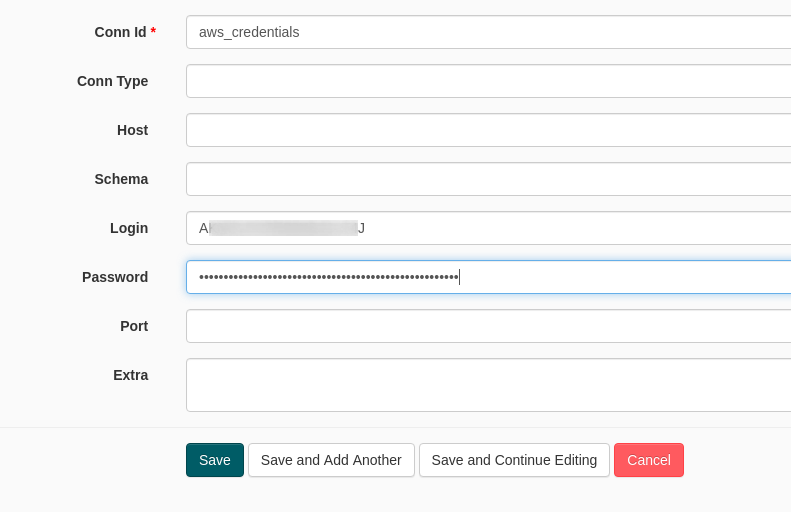
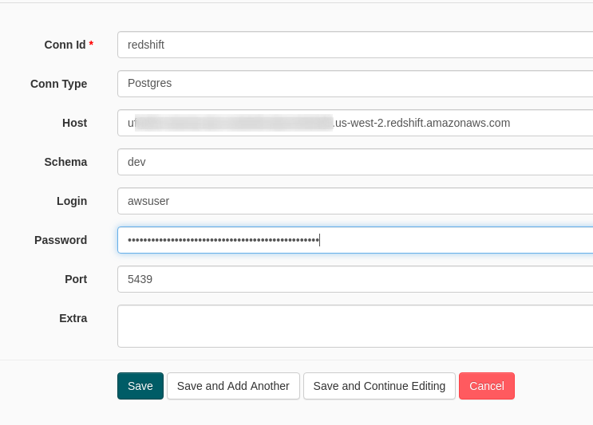
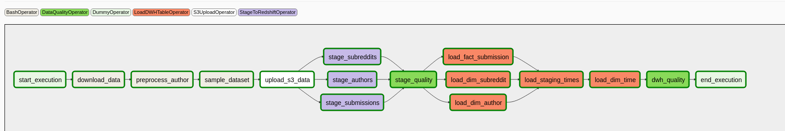

# Reddit Submissions in a Data Warehouse

## Data Engineering Capstone Project

### Project Summary

Reddit is "the frontpage of the internet" and has a broad range of discussions about nearly every topic one can think of. This makes it a perfect candidate for analytics.  
This project will use a publicly available dump of Reddit and load it into a AWS Redshift warehouse so that Data Scientists can make use of the content and for example develop a recommender system that finds the most suitable subreddit for your purposes.

The project follows the follow steps:
* Step 1: Scope the Project and Gather Data
* Step 2: Explore and Assess the Data
* Step 3: Define the Data Model
* Step 4: Run ETL to Model the Data
* Step 5: Complete Project Write Up

### Step 1: Scope the Project and Gather Data

#### Scope 

In this project I will combine multiple datasets to a single and consistent data set that is stored in a Data Warehouse.
The main goal is to provide data in a way that Data Scientists or other analysts can access the data through an SQL interface.

For this project I've chosen **AWS Redshift** as the Data Warehouse solution and provide a data pipeline that is orchestrated by **Apache Airflow**.
Analysts can then use this data to build dashboards or load relevants parts for further analysis.

An example which could be implemented by a Data Scientist could be a recommendation engine that recommends subreddits (like sub-forums) based on a number of keywords that a user is interested in.
E.g. 'self-made, smart home, lights' could end up in a suggestion of the subreddit [/r/homeautomation](https://www.reddit.com/r/homeautomation/).  
For this task submissions in all subreddits could be analyzed with natural language processing (NLP) to gain insights into the topics and relevant keywords.
Please note that it's not part of this project to implement a recommender system, but to build the data pipeline that leads to the Data Warehouse that holds the "ground truth" information for such analytic tasks.

The final pipeline includes:

- Bash commands
- Python helper scripts that are used as part of the bash commands
- Custom operators (based on Airflow `AwsHook` and `PostgresHook`) for communication with S3 and Redshift

#### Describe and Gather Data 

The data that is used for this project consists of one CSV two [NDJSON](http://ndjson.org/) data sets. Both datasets are compressed with the [ZStandard](https://facebook.github.io/zstd/) algorithm.

Data dumps of reddit have been made available through
[pushshift.io](http://files.pushshift.io/reddit/).
In this project I take a look into three of the available datasets:
- [Authors](http://files.pushshift.io/reddit/authors/)
- [Submissions](http://files.pushshift.io/reddit/submissions/)
- [Subreddits](http://files.pushshift.io/reddit/subreddits/)

Information more about the origin of the data can be found in [this submission](https://www.reddit.com/r/pushshift/comments/bcxguf/new_to_pushshift_read_this_faq/).

From a technical perspective I must assume that the data is incomplete because as far as I can tell it's not a real database dump of reddit but is otherwise aggregated - maybe it's periodically crawled, I am not entirely sure about this.
But nevertheless it's a huge dataset that will be fun to work with.

I've selected the most recent available dataset for the author data (`RA_78M.csv.zst`)  which is from Apr 23, 2019.
A sample of this data is located in [assets/sample-author.csv](./assets/sample-author.csv).
It contains data about the authors (or users) of reddit including their username, the timestamp when they joined reddit and the one of their last login. It also includes information about the "karma" of the users. 

The subreddit dataset (`Reddit_Subreddits.ndjson.zst`) is also the most recent one from Feb 12, 2019.
It contains 63 columns with information about a subreddit.
A subreddit is essentially a container for a certain topic, e.g. home-automation, that is discussed by the users.
Users have the option to start new "theads" in which they can discuss a certain sub-aspect of the overall topic of this subreddit.
In reddit speech this is called a "submission", see below.
A sample of a subreddit entry is given in [assets/sample-subreddit.json](./assets/sample-subreddit.json).
Interesting fields are the `display_name`, `title`, `url` and `description` fields, which show human-readable information about the name and purpose of a subreddit as well as it's URL from which it can be reached.

The submissions dataset is aggregated by month and holds information about new submissions in this month.
Contineous updates [have been published](http://files.pushshift.io/reddit/submissions/) from 2011-01 up until 2019-08, although the compression method has changed over time.
The pipeline that I provide in this project covers the ZStandard compression method as mentioned above but could be extended to also work with other compression methods, such as `bz2` and `xz`.
In this project I work with the latest submission data from 2019-08 but the Airflow pipeline can also be set to a earlier start date which would allow to also include data from other months.
A sample submission is given in [assets/sample-submission.json](./assets/sample-submission.json).
It contains 82 columns with data about the submission.
Most interesting fields are the `permalink`, which gives a URL to the submission, `subreddit`, which gives information about the subreddit in which the submission was posted, as well as the `title` of the submission.
Submissions can either be textual, the content is then stored in the column `selftext`, or be a link to a website or media content which is then stored in the `url` column.


### Step 2: Explore and Assess the Data

#### Explore the Data 

##### Data Exploration

Let's have a short look into the data and get a general understanding.

```
$ ls -lth input       
total 9,2G
-rw-r--r-- 1 dotcs dotcs 1,2G  3. Apr 17:00 RA_78M.csv.zst
-rw-r--r-- 1 dotcs dotcs 1,9G  3. Apr 09:08 Reddit_Subreddits.ndjson.zst
-rw-r--r-- 1 dotcs dotcs 6,1G  3. Apr 09:06 RS_2019-08.zst
```

The total size of all datasets is about 9GB - in a compressed form.
To keep the impact on the disk of my local machine small I try to avoid extracting the data, so all my local analysis will work with an on-the-fly decompression of the data where necessary.
Due to the fast decompression Zstandard is especially suited for that, so let's try it out.

First let's get an overview of how many rows each dataset has:

```
$ zstd -cdq input/RA_78M.csv.zst | wc -l
78130495

$ zstd -cdq input/RS_2019-08.zst | wc -l
21927461

$ zstd -cdq input/Reddit_Subreddits.ndjson.zst | wc -l 
49723295
```

There are about **78M users**, **21M submissions** and information about **49M subreddits** available.

Next let's see how the raw data is shaped:

```bash
zstd -cdq input/RA_78M.csv.zst | tail -n +45 | head -n 1 > assets/sample-author.csv
zstd -cdq input/RS_2019-08.zst | head -1 | jq > assets/sample-submission.json
zstd -cdq input/Reddit_Subreddits.ndjson.zst | head -1 | jq > assets/sample-subreddit.json
```

This gives us the three files located in the assets folder:

- [assets/sample-author.csv](./assets/sample-author.csv)
- [assets/sample-submission.json](./assets/sample-submission.json)
- [assets/sample-subreddit.json](./assets/sample-subreddit.json)

I have used those insights to infer a data model for both the staging area and later for the tables in the Data Warehouse since the datasets did not come with a pre-defined schema.

Sometimes it's not quite clear which values a field will contain - especially if there are null values in the single sample that I took above.
In those cases I can take a larger sample and have a look at all values in this field.
I have used this method several times to come up with a good data model.
[jq](https://stedolan.github.io/jq/) helps to get a quick insight into the dataset.

For example the following command

```bash
# Collect all values of the field 'subreddit' from the first 1000 rows.
# Sort them by the number of occurencies (desc).
zstd -cdq input/RS_2019-08.zst | head -n 1000 | jq ".subreddit" | sort | uniq -c | sort -nr
```

will return a result like this:

```
     31 "AskReddit"
     22 "dankmemes"
     16 "teenagers"
     15 "memes"
     13 "PewdiepieSubmissions"
     12 "MusicOL"
      9 "gonewild"
      7 "Minecraft"
      6 "no_views"
      6 "dirtypenpals"
```

Now it should be much clearer what data can be expected from the `subreddit` column.

##### Data quality issues

During the development of this project, I have faced several data quality issues.

###### CSV Dataset Issues

Unfortunately the CSV dataset that contains the authors is quite bad.
The data is separated by whitespace, but unfortunately some listed usernames do also contain whitespace.

A little research shows that this might be wrong, because reddit used to use the following regex to test for the username until Oct, 4 2016:
```python
# Source: https://github.com/reddit-archive/reddit/blob/master/r2/r2/lib/validator/validator.py#L1570
user_rx = re.compile(r"\A[\w-]+\Z", re.UNICODE)
```

Because Redshift can load CSV data from S3 but cannot process data along the way I had to pre-process the data.
Otherwise the CSV parser of Redshift would fail because not all rows would have the same number of columns.

Another issue is that in case a reddit user account has been deleted there are no values for multiple columns (`created` timestamp + karma columns).
Instead the string `None` is set.

I have added a small [Python script](./scripts/preprocess_authors.py) that takes care of preprocessing lines in this dataset by reading from stdin line by line and use a Regular Expression to extract and manipulate the fields.
It then outputs the same line, but this time with pipes as separators instead of whitespace.

So for example the test entry

``` bash
# Original entry
$ cat assets/sample-author.csv           
77714 hockeyschtick 1137474000 1540040752 11329 451

# Same entry piped through preprocessing script
$ cat assets/sample-author.csv | ./scripts/preprocess_authors.py 
77714|hockeyschtick|1137474000|1540040752|11329|451|1
```

The script adds a single column at the end which is either 1 or 0 and determines if the username is valid or not.

###### Submission Dataset Issues

Also the submissions dataset had some issues.
While importing the data into the staging area in Redshift I noticed that several entries caused issues because their text was longer than what Redshift can deal with. Redshift can only [store text up to 65k bytes](https://docs.aws.amazon.com/redshift/latest/dg/r_Character_types.html).

I have isolated an [erroneous entry](./pitfalls/submission-erroneous-entry.json) which has a too long value in the `selftext` field.
To me this entry looks like either an error or a hacking attempt of the
Reddit platform.
Because I did not find a way to increase the size of the text field in Redshift I decided to remove such entries, which I have done by adding [`MAXERROR`](https://docs.aws.amazon.com/en_us/redshift/latest/dg/copy-parameters-data-load.html#copy-maxerror) to the `stage_submissions` task in Airflow.
This allows Redshift to ignore such problematic records.

###### Duplicate Data

Duplicate rows are taken care of when importing the data from the staging area to the DWH tables.
I have used `SELECT DISTINCT` queries as the sub-queries which will drop duplicate rows.

Otherwise the dataset is quite good w.r.t. duplicates, which means that no further effort was necessary from my side to take care of duplicated values.

#### Cleaning Steps

As described in the previous section "Data quality issues" I had to do two cleaning steps:
- The author dataset required a preprocessing because of issues with the CSV formatting.
  This is done in the Airflow task `preprocess_author`.
- The submission dataset contains rows that have issues, e.g. a text that is longer than what Redshift can store.
  This issue has been fixed by skipping those entries.

### Step 3: Define the Data Model

#### 3.1 Conceptual Data Model

The data model I have chosen is very close to what the datasets already provide.
In the staging areas I have used `varchar(max)` quite often to be able to import the data without any issues.
The final data model has much less `varchar(max)` fields, because it's much easier for Redshift to handle the data if the schema uses small datatypes where possible.

The data models for staging the data can be seen in the file [sql/create_staging_tables.sql](./sql/create_staging_tables.sql).
Because there are so many columns I have just explicitly explained some of them in the final data model:

- Data model: [fact_submission](./data_model/fact_submission.md)
- Data model: [dim_author](./data_model/dim_author.md)
- Data model: [dim_subreddit](./data_model/dim_subreddit.md)
- Data model: [dim_time](./data_model/dim_time.md)

The final data model varies from the original data model in some places.

- `dim_author`
  - Column `karma` has been added: Gives information about the total karma, which might be relevant very often and thus should be pre-aggregated
  - Column `deleted` has been added: Pre-aggregated column from missing values in the columns `created`, `karma_posts` and `karma_comments`
- `dim_subreddit`:
  - Column `over18` has been renamed to `over_18` to be consistent with the `fact_submission` table
- `fact_submission`:
  - `null` values in column `edited` have been replaced with `false`
  - `null` values in column `event_is_live` have been replaced with `false`
  - `null` values in column `suggested_sort` have been replaced with string `'default'`
  - `null` values in column `whitelist_status` have been replaced with string `'default'`
- `dim_time`: This table has been added to make it easy for analysts to query dates based on various common questions, such as week numbers, day of week, etc.

Many other optimizations could have been done because the datasets have so many columns but I think this should be sufficient to showcase transformations on the data.

#### 3.2 Mapping Out Data Pipelines

Airflow has been used to automate literally all steps in the pipeline:

- Download the data to the worker
- Preprocess data (some datasets only)
- Upload the data to S3
- Extracting the data from S3 to a staging area in AWS Redshift 
- Transform and load the data to fact and dimension tables in AWS Redshift

### Step 4: Run Pipelines to Model the Data 

#### Preconditions

A working Python (>= Python 3.6) environment is required.

In this enviroment run

```bash
pip install -r requirements.txt
``` 

or use the provided Anaconda environment

```bash
conda create -p ./.conda-env python=3.7 --file requirements.txt
conda activate ./.conda-env
```

Then start Airflow:

```bash
bash run_airflow.sh
```

This will start the Airflow scheduler and webserver in parallel.

Make sure to have a AWS Redshift cluster running.
The setup requires you to have two credentials stored in your Airflow instance as connections:

| Credentials Name | Description |
|:--|:--|
| aws_credentials  | Credentials for your AWS user. Use fields `login` and `password` and set your `access_key` and `secret_access_key` here. The user must have the permissions: `AmazonS3FullAccess` and `AmazonRedshiftFullAccess`.  |
| redshift | Choose "Postgres" as the connection type. Enter your AWS Redshift credentials here. Your database name should be stored in the field named "Schema". |





Also make sure that the tables exist on the cluster.
The SQL queries to create them can be found in the file [`create_staging_tables.sql`](./sql/create_staging_tables.sql) and [`create_dwh.sql`](./sql/create_dwh_tables.sql).

Then go to http://localhost:8080 and enable the DAG named `reddit` to start the process.

#### 4.1 Create the data model

The final pipeline looks like this:



The staging tables take the data as-is (`staging_authors` table is an exception as mentioned above).
Data transformation is done while loading the data to the fact and dimension tables.
Details can be seen in the [SQL queries](./airflow/plugins/helpers/sql_queries.py).

Because the tables `dim_author`, `fact_submission` and `dim_subreddit` all contain timestamps, I have decided to first collect all of the timestamps, which is done in task `load_staging_times` and then transform them and write them to the `dim_time` table.

*Additional note: The task `sample_dataset` is optional and can be left out to load the full dataset into the AWS Redshift Data Warehouse.*

#### 4.2 Data Quality Checks

Data quality checks have been implemented after the staging tables have been loaded (task: `stage_quality`) and after the Data Warehouse tables have been filled (task: `dwh_quality`).

I decided to test that columns are not empty in the staging area and do more explicit test at the end of the pipeline.
There I check that the fact and dimension tables are not empty, that columns do not contain `NULL` values and that the author column does not contain a whitespace (which is a result of the preprocessing and the phase where data is inserted from the staging area to the dimension table).

#### 4.3 Data dictionary 

Please refer to those files that I have already mentioned above:

- Data model: [fact_submission](./data_model/fact_submission.md)
- Data model: [dim_author](./data_model/dim_author.md)
- Data model: [dim_subreddit](./data_model/dim_subreddit.md)
- Data model: [dim_time](./data_model/dim_time.md)

#### Step 5: Complete Project Write Up

I think most things are already said.
Now that this dataset is available in a AWS Redshift Data Warehouse the Data Scientists and Analysts can take over and create AI models and dashboards from this data.
New data can be processed as it arrives, Airflow can be used to track and visualize the progress.
I guess this makes my solution a good fit for what I wanted to achieve.

The pipeline will be executed on a monthly basis, which makes sense as long as new data is published to pushshift.io. (Unfortunately new data has not been uploaded since 2019-08).
I have pre-configured the DAG to reflect this setting (`schedule_interval='@monthly'`).

A sample query that brings all tables together could be:

```sql
SELECT DISTINCT substring(fs.title, 1, 50), da.name as author, da.karma as author_karma, ds.display_name as subreddit, ds.subscribers as subreddit_subscribers, dt.start_time as created_at
FROM fact_submission fs 
INNER JOIN dim_author da 
  ON (fs.author_id = da.author_id)
INNER JOIN dim_subreddit ds
  ON (fs.subreddit_id = ds.subreddit_id) 
INNER JOIN dim_time dt
  ON (fs.created = dt.start_time) 
WHERE 
  (dt.weekday = 6 OR dt.weekday = 1)  -- weekend
  AND subscribers > 1000
ORDER BY fs.created ASC
LIMIT 10;
```

with the following result

```
                    substring                      |   author    | author_karma |      subreddit      | subreddit_subscribers |     created_at      
----------------------------------------------------+-------------+--------------+---------------------+-----------------------+---------------------
 Feeling marginalized by the California Democratic  | BlankVerse  |      2323804 | California_Politics |                  7163 | 2019-08-03 00:00:29
 Feeling marginalized by the California Democratic  | BlankVerse  |      2323804 | democrats           |                 84178 | 2019-08-03 00:00:59
 Feeling marginalized by the California Democratic  | BlankVerse  |      2323804 | VoteBlue            |                 27478 | 2019-08-03 00:01:22
 Feeling marginalized by the California Democratic  | BlankVerse  |      2323804 | Blackfellas         |                 22425 | 2019-08-03 00:01:48
 How would you regain trust?                        | contantofaz |        40077 | AskReddit           |              21449888 | 2019-08-03 00:02:55
 China on Friday vowed to fight back against U.S. P | madam1      |      1745248 | worldnews           |              20465518 | 2019-08-03 00:03:04
 A Ratcliffe is 3/5 of a Mooch.                     | brokenarrow |       159310 | theydidthemooch     |                  1013 | 2019-08-03 00:03:19
 Looking to change plan from TV+Internet to Interne | jsomer      |         1177 | Comcast_Xfinity     |                  6873 | 2019-08-03 00:03:37
 Renunció Enrique Canon, el director nacional de Ad | yorugua     |        16256 | uruguay             |                  6900 | 2019-08-03 00:03:44
 GetOut #2                                          | zeroack     |        21244 | overlanding         |                 41897 | 2019-08-03 00:05:05
(10 rows)
```

##### Questions & Answers / Outlook

* **Question**: *What would happen if the data was increased by 100x?*  
  **Answer**: This would mean that the data grows from now 9GB to about 900GB (compressed). While it's technially not a problem to have a few TB of data stored on a single machine I guess it would make sense to make use of the fact that Redshift is a distributed Data Warehouse solution and use 2 or more nodes. I expect the largest growth in the `fact_submission` table, because each new month will bring another 6GB of data or likely even more. Depending on the size of the dimension tables, and on how often they are joined, it might make sense to make them available local to all worker nodes, which can be done by setting `diststyle ALL` to the dimension tables. Also it might make sense to re-think the possible queries and optimize tables even further for the queries, e.g. by setting the `sortkey` and `distkey` values depending on the type of queries. It might even make sense to duplicate fact and/or dimension tables with a diffent sorting or distribution schema if the queries vary strongly in their access patterns.
  Loading the data might also be an issue at some point. I think it would make sense to split the datasets into multiple chunks to make them smaller. Redshift can then parallelize the load from S3 and thus make use of all the workers in this phase.
  The [make_chunks.py](./scripts/make_chunks.py) file should get a rough idea of how this could look like. (It would need to be adjusted though before it can be used in the Airflow data pipeline.)
* **Question**: *What would happen if the pipelines would be run on a daily basis by 7 am every day?*  
  **Answer**: Technically Airflow is perfectly suited for this scenario. Although the source datasets are aggregated by month, not by day. This means that running the pipeline on a daily basis would not make much sense - unless the data is provided in a different aggregated form. The import takes much less than 24 hours, so it is also not an issue from a timing perspective.  
  A problem would be that in the current configuration the fact table `fact_submission` would have duplicated content if the task `load_fact_submission` is executed multiple times per month because the current setting is `update_mode='append'` which means that the table is not truncated before new data is inserted.
* **Question**: *What would happen if the database needed to be accessed by 100+ people?*  
  **Answer**: The load of the database depends on the frequency and the impact of the individual queries. If the load is getting to high it would make sense to scale the database horizontally by adding more nodes to bring down the load for each individual node. Depending on the type of queries it could make sense to optimize the database in a similar way that has been described in the first question.